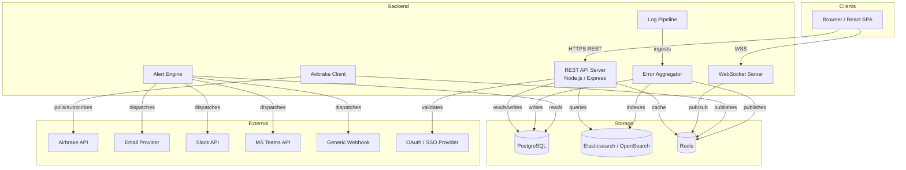

# Design Document: Live Airbrake Monitoring Portal

## Overview

The Live Airbrake Monitoring Portal is a centralized web application that integrates with the Airbrake API to provide real-time visibility into application errors, logs, and system health across multiple services. It serves development and operations teams with live dashboards, drill-down error analysis, configurable alerts, and historical reporting.

The system is composed of a React-based frontend, a Node.js/Express backend API, a WebSocket server for real-time streaming, a background Alert Engine, and an Airbrake Client integration layer. Data is persisted in PostgreSQL (structured records) and Elasticsearch/OpenSearch (search index), with Redis used for caching and pub/sub.

### Key Design Goals

- Sub-2-second log delivery to connected clients via WebSocket
- Reliable error grouping via fingerprinting
- Role-based access control (Admin, Developer, Viewer)
- Configurable retention (30/60/90 days) with automated purge
- Round-trip fidelity for all parsed log and error records

---

## Architecture



### Technology Choices

| Layer | Technology | Rationale |
|---|---|---|
| Frontend | React + TypeScript | Component model suits dashboard widgets; TypeScript reduces runtime errors |
| Backend API | Node.js + Express | Non-blocking I/O suits high-throughput log ingestion |
| WebSocket | ws / Socket.IO | Persistent push for real-time log streaming |
| Primary DB | PostgreSQL | Relational integrity for users, alerts, RBAC |
| Search Index | Elasticsearch / OpenSearch | Full-text search, aggregations, time-series queries |
| Cache / Pub-Sub | Redis | Low-latency pub/sub for WebSocket fan-out; session caching |
| Auth | OAuth 2.0 / OIDC | Requirement 7.1 mandates OAuth/SSO |

---

## Components and Interfaces

### 1. Airbrake Client (`AirbrakeClient`)

Polls or subscribes to the Airbrake REST API at a configurable interval. Normalizes raw Airbrake payloads into internal `Break` records and publishes them to the Redis `breaks` channel.

```typescript
interface AirbrakeClientConfig {
  apiKey: string;          // encrypted at rest, never exposed
  projectId: string;
  pollIntervalMs: number;  // configurable per Requirement 2.6
}

interface AirbrakeClient {
  start(): void;
  stop(): void;
  onBreak(handler: (b: Break) => void): void;
}
```

### 2. Error Aggregator (`ErrorAggregator`)

Consumes raw Break records, computes a fingerprint, and groups them. Classifies each Break as new, existing, or regression.

```typescript
type BreakStatus = 'new' | 'existing' | 'regression';

interface AggregationResult {
  group: BreakGroup;
  status: BreakStatus;
}

interface ErrorAggregator {
  aggregate(b: Break): AggregationResult;
}
```

### 3. Log Pipeline (`LogPipeline`)

Accepts log entries from the Airbrake API or direct ingestion endpoint, parses them into normalized `LogRecord` objects, and writes them to PostgreSQL and Elasticsearch.

```typescript
interface LogPipeline {
  ingest(raw: unknown): Promise<void>;
}
```

### 4. WebSocket Server

Subscribes to Redis pub/sub channels (`logs`, `breaks`) and fans out messages to connected browser clients. Handles reconnection state and notifies clients of disconnection.

### 5. Alert Engine (`AlertEngine`)

Runs on a configurable tick, evaluates all active alert rules against recent Break counts, and dispatches notifications via configured channels with retry logic.

```typescript
interface AlertRule {
  id: string;
  threshold: number;
  windowSeconds: number;
  channels: NotificationChannel[];
  triggerOnNewError: boolean;
}

interface AlertEngine {
  evaluate(): Promise<void>;
  dispatch(rule: AlertRule, event: AlertEvent): Promise<void>;
}
```

### 6. REST API

Exposes endpoints for:
- Authentication (OAuth callback, session management)
- Breaks CRUD and search
- Log search and export
- Dashboard aggregation queries
- Alert rule management
- User and RBAC management
- Saved filters
- Retention policy configuration

All endpoints enforce RBAC middleware before handler execution.

### 7. React Frontend

Key views:
- **Dashboard** — widgets, time-series graph, deployment overlays, theme toggle
- **Log Stream** — live WebSocket feed with filter controls
- **Breaks List** — paginated, filterable error list with status badges
- **Break Detail** — stack trace, request payload, correlated logs, lifecycle
- **Alert Management** — rule creation/editing (Admin/Developer only)
- **Settings** — user management, retention policy (Admin only)

---

## Data Models

### LogRecord

```typescript
interface LogRecord {
  id: string;
  applicationId: string;
  environment: 'production' | 'qa' | 'development';
  severity: 'info' | 'warning' | 'error' | 'critical';
  message: string;
  timestamp: Date;
  tags: string[];
  rawPayload: Record<string, unknown>;
}
```

### Break

```typescript
interface Break {
  id: string;
  applicationId: string;
  environment: string;
  severity: 'info' | 'warning' | 'error' | 'critical';
  errorMessage: string;
  stackTrace: string;
  endpoint: string | null;
  requestPayload: Record<string, unknown> | null;
  userSession: Record<string, unknown> | null;
  timestamp: Date;
  fingerprint: string;
}
```

### BreakGroup

```typescript
interface BreakGroup {
  id: string;
  fingerprint: string;
  applicationId: string;
  firstOccurrence: Date;
  lastOccurrence: Date;
  occurrenceCount: number;
  status: 'open' | 'resolved' | 'regression';
  severity: 'info' | 'warning' | 'error' | 'critical';
  errorMessage: string;
}
```

### User and RBAC

```typescript
type Role = 'admin' | 'developer' | 'viewer';

interface User {
  id: string;
  email: string;
  role: Role;
  oauthProvider: string;
  oauthSubject: string;
  createdAt: Date;
}
```

### AlertRule

```typescript
type NotificationChannel =
  | { type: 'email'; address: string }
  | { type: 'slack'; webhookUrl: string }
  | { type: 'teams'; webhookUrl: string }
  | { type: 'webhook'; url: string };

interface AlertRule {
  id: string;
  name: string;
  threshold: number;
  windowSeconds: number;
  triggerOnNewError: boolean;
  channels: NotificationChannel[];
  createdBy: string;
  enabled: boolean;
}
```

### SavedFilter

```typescript
interface SavedFilter {
  id: string;
  userId: string;
  name: string;
  criteria: {
    keyword?: string;
    tags?: string[];
    severity?: string[];
    applications?: string[];
    timeRange?: { from: Date; to: Date };
    errorCode?: string;
  };
}
```

### RetentionPolicy

```typescript
interface RetentionPolicy {
  applicationId: string;
  retentionDays: 30 | 60 | 90;
}
```

---

## Correctness Properties

*A property is a characteristic or behavior that should hold true across all valid executions of a system — essentially, a formal statement about what the system should do. Properties serve as the bridge between human-readable specifications and machine-verifiable correctness guarantees.*

### Property 1: Filter Correctness

*For any* set of log entries and any combination of filter criteria (application, environment, severity, timestamp range), the filtered result set should contain only entries that satisfy every active filter criterion simultaneously, and no entry that fails any criterion.

**Validates: Requirements 1.4, 1.6**

---

### Property 2: Search Result Correctness

*For any* keyword, tag, or error code query and any set of log entries or Breaks, every result returned by the search should contain the query term, and no result should be returned that does not match the query.

**Validates: Requirements 1.5, 8.1**

---

### Property 3: Break Detail View Contains Required Fields

*For any* Break record, the rendered detail view should include the error message, full stack trace, affected endpoint or module, occurrence frequency, first occurrence, last occurrence, occurrence count, and resolution status.

**Validates: Requirements 2.1, 4.1, 4.3**

---

### Property 4: Fingerprint Grouping

*For any* two Break records sharing the same fingerprint, the Error Aggregator should assign them to the same BreakGroup, and for any two Break records with different fingerprints, they should be assigned to different groups.

**Validates: Requirements 2.2**

---

### Property 5: New Error Classification

*For any* Break whose fingerprint does not exist in the current set of BreakGroups, the Error Aggregator should classify it as "new" and the resulting group should carry the "New" label.

**Validates: Requirements 2.3**

---

### Property 6: Regression Classification

*For any* BreakGroup in "resolved" status, receiving a new Break with the same fingerprint should transition the group to "regression" status.

**Validates: Requirements 2.4**

---

### Property 7: Dashboard Break Count Aggregation

*For any* set of Break records with known timestamps, the dashboard aggregation function should return a count equal to the number of Breaks whose timestamps fall within the specified time window (24 hours or 7 days), and the error rate trend should reflect the actual distribution of Breaks over that window.

**Validates: Requirements 3.1, 3.2**

---

### Property 8: Top Services Ranking

*For any* set of Break records grouped by service, the top-failing-services list should be ordered in descending order of Break frequency, and no service with a higher Break count should appear after a service with a lower Break count.

**Validates: Requirements 3.3**

---

### Property 9: Bucketing Preserves Total Count

*For any* set of records (Breaks or log entries) and any bucketing granularity (hourly, daily) or grouping dimension (severity), the sum of all bucket or group counts should equal the total number of input records.

**Validates: Requirements 3.4, 3.5**

---

### Property 10: Theme Preference Round-Trip

*For any* theme preference value (dark or light), saving the preference and then loading it should return the same value.

**Validates: Requirements 3.7**

---

### Property 11: Log Correlation Correctness

*For any* Break and any set of log entries, the correlated log entries returned should only include entries whose timestamp falls within the Break's timestamp range and whose application identifier matches the Break's application identifier.

**Validates: Requirements 4.2**

---

### Property 12: Missing Data Graceful Handling (Edge Case)

*For any* Break record where `requestPayload` or `userSession` is null or absent, the rendered detail view should contain an explicit "not available" indicator for those fields rather than an empty or broken UI section.

**Validates: Requirements 4.4**

---

### Property 13: Alert Threshold Triggering

*For any* alert rule with a configured threshold T and time window W, if the number of Breaks within the rolling window W equals or exceeds T, the Alert Engine should dispatch a notification to all configured channels for that rule.

**Validates: Requirements 5.1, 5.2**

---

### Property 14: New Error Alert Triggering

*For any* alert rule configured to trigger on new error types, and any Break classified as "new" by the Error Aggregator, the Alert Engine should dispatch a notification to all configured channels for that rule.

**Validates: Requirements 5.3**

---

### Property 15: RBAC Enforcement

*For any* user with a given role and any API endpoint, the response should be authorized if and only if the endpoint is within the set of permissions granted to that role: Viewers may only access read-only endpoints; Developers may additionally access alert configuration and saved filter endpoints; Admins may additionally access user management, application configuration, and retention policy endpoints. Any access attempt outside the user's role permissions should return an authorization error.

**Validates: Requirements 5.5, 6.3, 6.4, 6.5, 6.6**

---

### Property 16: Unauthenticated Access Rejection

*For any* request to a protected endpoint that does not carry a valid session token, the response should be an authentication error (HTTP 401), and no protected data should be returned.

**Validates: Requirements 7.1**

---

### Property 17: API Key Not Exposed in Responses

*For any* API response body, the response should not contain any plaintext Airbrake API key value.

**Validates: Requirements 7.3**

---

### Property 18: Session Expiry Preserves Redirect URL

*For any* expired session and any originally requested URL, the post-authentication redirect should navigate the user to the originally requested URL.

**Validates: Requirements 7.4**

---

### Property 19: Saved Filter Round-Trip

*For any* valid saved filter definition, saving the filter and then loading it by its identifier should return a filter with identical criteria.

**Validates: Requirements 8.3, 8.4**

---

### Property 20: Export Contains All Records

*For any* set of search results, exporting in CSV format and in JSON format should each produce output that contains exactly the same records as the search result set, with no records omitted or added.

**Validates: Requirements 8.5, 9.4**

---

### Property 21: Retention Purge Correctness

*For any* configured retention period R (30, 60, or 90 days), after the purge process runs, no log entry or Break record with a timestamp older than R days should appear in any query result.

**Validates: Requirements 9.1, 9.2**

---

### Property 22: Parsing Produces Valid Normalized Records

*For any* valid log entry payload or error payload, parsing it should produce a normalized record (LogRecord or Break) with all required fields populated and no required field null or missing.

**Validates: Requirements 10.1, 10.2**

---

### Property 23: Malformed Payload Handled Without Crash

*For any* malformed or incomplete payload (missing required fields, invalid JSON, unexpected types), the parse function should return an error result and not throw an unhandled exception, leaving the ingestion pipeline in a running state.

**Validates: Requirements 10.3**

---

### Property 24: Parse-Serialize-Parse Round-Trip

*For any* valid normalized LogRecord or Break record, serializing it to JSON and then parsing the resulting JSON should produce a record equivalent to the original.

**Validates: Requirements 10.4, 10.5**

---

## Error Handling

### Ingestion Pipeline Errors

- Malformed payloads are caught at the parser boundary, logged with the raw payload, and discarded. The pipeline continues processing subsequent records (Requirement 10.3).
- Parse errors are written to a dedicated `parse_errors` table for operator review.

### WebSocket Disconnection

- The frontend WebSocket client implements exponential backoff reconnection (initial 1s, max 30s).
- While disconnected, the UI displays a persistent "Disconnected — reconnecting…" banner (Requirement 1.3).
- On reconnect, the client requests a replay of missed events within a configurable window.

### Notification Dispatch Failures

- The Alert Engine wraps each dispatch attempt in a try/catch.
- On failure, it schedules a retry with exponential backoff: 1s, 2s, 4s.
- After 3 failed attempts, the notification record is marked `failed` and an internal alert is raised (Requirement 5.6).

### Authentication and Authorization Errors

- Unauthenticated requests to protected endpoints return HTTP 401 with a redirect hint.
- Unauthorized requests (valid session, insufficient role) return HTTP 403 and log the access attempt to the audit log (Requirement 6.6).
- Expired sessions redirect to the OAuth flow with the original URL preserved as a `redirect_uri` parameter (Requirement 7.4).

### Airbrake API Errors

- The Airbrake Client wraps API calls with retry logic (3 attempts, exponential backoff).
- On persistent failure, the client logs the error and continues polling on the next interval.
- The Dashboard displays a "Airbrake API unreachable" warning when the client has not successfully fetched data within 2× the configured poll interval.

### Missing Break Data

- When `requestPayload` or `userSession` is null, the Break detail view renders a styled "Data not available" placeholder rather than an empty section (Requirement 4.4).

---

## Testing Strategy

### Dual Testing Approach

Both unit tests and property-based tests are required. They are complementary:

- **Unit tests** verify specific examples, integration points, edge cases, and error conditions.
- **Property-based tests** verify universal properties across many randomly generated inputs, catching edge cases that hand-written examples miss.

### Property-Based Testing

**Library**: [fast-check](https://github.com/dubzzz/fast-check) (TypeScript/JavaScript)

Each correctness property defined above must be implemented as a single property-based test using fast-check. Tests must be configured to run a minimum of 100 iterations.

Each test must be tagged with a comment in the following format:

```
// Feature: live-airbrake-monitoring-portal, Property <N>: <property_text>
```

Example:

```typescript
// Feature: live-airbrake-monitoring-portal, Property 24: Parse-Serialize-Parse Round-Trip
it('parse-serialize-parse round-trip for LogRecord', () => {
  fc.assert(
    fc.property(arbitraryLogPayload(), (payload) => {
      const record1 = parseLogRecord(payload);
      const json = serializeLogRecord(record1);
      const record2 = parseLogRecord(JSON.parse(json));
      expect(record2).toEqual(record1);
    }),
    { numRuns: 100 }
  );
});
```

### Unit Testing

Unit tests should focus on:

- Specific examples demonstrating correct behavior (e.g., a known Break payload parses to the expected record)
- Integration points between components (e.g., ErrorAggregator correctly writes to PostgreSQL)
- Edge cases and error conditions (e.g., empty payload, null fields, maximum-length strings)
- RBAC boundary conditions (e.g., exactly the boundary between Viewer and Developer permissions)

Avoid writing unit tests that duplicate what property tests already cover comprehensively.

### Test Organization

```
src/
  __tests__/
    unit/
      parser.test.ts
      aggregator.test.ts
      alertEngine.test.ts
      rbac.test.ts
      ...
    property/
      parser.property.test.ts       # Properties 22, 23, 24
      filter.property.test.ts       # Properties 1, 2
      aggregator.property.test.ts   # Properties 4, 5, 6
      dashboard.property.test.ts    # Properties 7, 8, 9
      rbac.property.test.ts         # Properties 15, 16
      alert.property.test.ts        # Properties 13, 14
      export.property.test.ts       # Properties 20, 21
      ...
```

### Coverage Targets

- All 24 correctness properties must have a corresponding property-based test.
- Unit test coverage target: 80% line coverage for backend services.
- Property tests run in CI with `--numRuns 100` minimum; nightly runs use `--numRuns 1000`.
